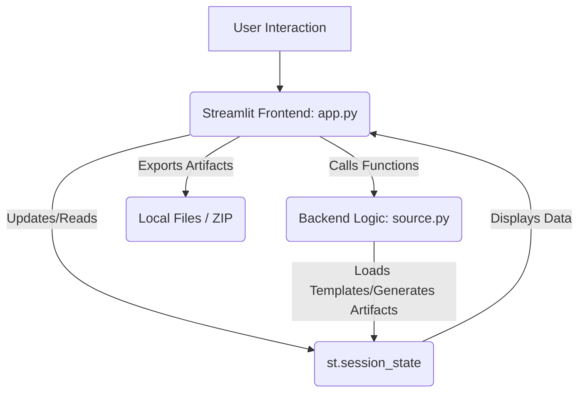

id: 69722f017698ec9b5aacdd3d_documentation
summary: Lab 13: Sector Playbook Builder (Healthcare & Finance) Documentation
feedback link: https://docs.google.com/forms/d/e/1FAIpQLSfWkOK-in_bMMoHSZfcIvAeO58PAH9wrDqcxnJABHaxiDqhSA/viewform?usp=sf_link
environments: Web
status: Published
# QuLab: Building an AI Risk Playbook with Streamlit

## 1. Introduction to AI Risk Management and the QuLab Application
Duration: 0:05:00

<aside class="positive">
This introductory step is crucial for establishing context. It highlights the business problem addressed by the application, the role it plays in AI governance, and the core concepts that developers will encounter. Understanding the 'why' makes the 'how' much more impactful.
</aside>

In today's rapidly evolving technological landscape, Artificial Intelligence (AI) systems are being integrated into critical business functions across various sectors, from healthcare to finance. While AI offers immense opportunities, it also introduces complex risks, including bias, lack of transparency, security vulnerabilities, and potential for unintended harm. Managing these risks effectively is paramount, not only for regulatory compliance but also for maintaining public trust and ensuring responsible innovation.

The **QuLab: Lab 13: Sector Playbook Builder** Streamlit application is designed to empower AI Risk Leads, such as our persona Dr. Evelyn Reed, to systematically define and manage AI risks. This tool automates the generation of sector-specific AI risk playbooks, validation checklists, monitoring Key Performance Indicators (KPIs), and incident triggers. It provides a comprehensive framework for tailoring AI governance to the unique characteristics of each AI initiative, considering its sector, system type (e.g., ML, LLM), and inherent risk tier.

**Key Concepts Explained:**

*   **Sector-Specific Controls:** Recognizing that AI risks manifest differently across industries, the application demonstrates how regulatory and ethical considerations specific to sectors like Healthcare and Finance necessitate unique control mechanisms.
*   **Dynamic Playbook Generation:** Instead of static templates, this application showcases a dynamic approach where risk artifacts are generated on-the-fly based on selected AI system parameters, ensuring adaptability and relevance.
*   **Proactive Governance:** By defining controls, validation metrics, and monitoring triggers upfront, organizations can proactively mitigate risks, allocate resources efficiently, and establish clear communication channels between risk leads, domain experts, and model validators.
*   **Auditability and Transparency:** The application emphasizes the importance of generating auditable artifacts, including an evidence manifest with cryptographic hashes, to demonstrate compliance and provide a transparent record of risk assessments.

### Application Architecture Overview

The application leverages Streamlit for its interactive user interface, allowing users to navigate through various stages of the AI risk playbook generation. The core logic for loading templates, generating playbooks, checklists, and summaries resides in a backend `source.py` module (not explicitly provided but essential for the application's functionality). User interactions update the `st.session_state`, which persists data across reruns and navigations.

Here's a simplified architectural diagram illustrating the application's workflow:



<aside class="negative">
Remember that while `source.py` is mentioned, its actual code is not provided. For real-world development, you would need to implement these backend functions that handle data loading, template matching, and content generation.
</aside>

## 2. Setting Up the Environment and Loading Initial Data
Duration: 0:03:00

To begin, ensure you have Streamlit installed. If not, you can install it via pip:

```console
pip install streamlit
```

Save the provided Streamlit application code as `app.py`. To run the application, navigate to its directory in your terminal and execute:

```console
streamlit run app.py
```

This command will open the application in your default web browser.

Upon launching, the application presents the "Sector & Use-Case Wizard" page. This is the starting point for Evelyn's workflow.

The application utilizes `st.session_state` to maintain the state of variables across user interactions and page navigations. This is crucial for remembering selections and generated content.

```python
#  Session State Initialization 
if 'current_page' not in st.session_state:
    st.session_state.current_page = "Sector & Use-Case Wizard"
# ... other session state variables ...
```

The first interactive step is to load the predefined AI control templates and sample use cases. These are the foundational data assets that enable the dynamic playbook generation.

Navigate to the "Sector & Use-Case Wizard" page (which is the default on startup).
Click on the **"Load AI Control Templates & Use Cases"** button.

```python
st.button("Load AI Control Templates & Use Cases", on_click=load_data_callback, disabled=st.session_state.data_loaded)
```

This button triggers the `load_data_callback` function:

```python
def load_data_callback():
    st.session_state.all_use_cases = load_sample_use_cases() # Assumes load_sample_use_cases() is in source.py
    st.session_state.data_loaded = True
    if st.session_state.all_use_cases:
        st.session_state.selected_use_case_display = f"{st.session_state.all_use_cases[0]['name']} ({st.session_state.all_use_cases[0]['id']})"
        update_selected_use_case() # Automatically selects the first use case
    st.success("AI Control Templates and Use Cases Loaded!")
```

Once loaded, you'll see a success message, and the application will enable the next set of controls for selecting an AI initiative.

## 3. Configuring an AI Initiative
Duration: 0:04:00

With the control templates and use cases loaded, Evelyn can now select a specific AI initiative to work on. This selection is critical as it defines the `sector`, `system_type`, and `risk_tier`—the key parameters that drive the dynamic generation of the risk playbook.

On the "Sector & Use-Case Wizard" page, observe the **"Choose an AI Use Case"** dropdown.

```python
# ... inside if st.session_state.data_loaded: ...
use_case_options = {f"{uc['name']} ({uc['id']})": uc['id'] for uc in st.session_state.all_use_cases}

# Find the index of the currently selected item to set the default
current_index = 0
if st.session_state.selected_use_case_display in list(use_case_options.keys()):
     current_index = list(use_case_options.keys()).index(st.session_state.selected_use_case_display)

st.selectbox(
    "Choose an AI Use Case",
    options=list(use_case_options.keys()),
    index=current_index,
    key="selected_use_case_display",
    on_change=update_selected_use_case
)
```

The `on_change=update_selected_use_case` callback ensures that whenever a new use case is selected, the application's state is updated accordingly:

```python
def update_selected_use_case():
    if st.session_state.selected_use_case_display and st.session_state.data_loaded:
        use_case_options = {f"{uc['name']} ({uc['id']})": uc['id'] for uc in st.session_state.all_use_cases}
        selected_id = use_case_options[st.session_state.selected_use_case_display]
        st.session_state.selected_use_case = select_use_case(selected_id, st.session_state.all_use_cases) # Assumes select_use_case() in source.py
        st.session_state.current_sector = st.session_state.selected_use_case['sector']
        st.session_state.current_system_type = st.session_state.selected_use_case['system_type']
        st.session_state.current_risk_tier = st.session_state.selected_use_case['risk_tier']
        st.session_state.current_sector_templates = load_control_templates(st.session_state.current_sector) # Assumes load_control_templates() in source.py
        
        # Reset playbook generation state to allow regeneration for new use case
        st.session_state.playbook_components_generated = False
        st.session_state.final_artifacts_generated = False
        # ... reset other generated artifacts ...
```

After selecting a use case, the application displays its details, including the derived sector, system type, and risk tier. These parameters will govern the subsequent generation of risk artifacts.

Finally, click the **"Generate Playbook Components"** button.

```python
st.button("Generate Playbook Components", key="generate_components_button", on_click=generate_playbook_components_callback, disabled=not st.session_state.selected_use_case or st.session_state.playbook_components_generated)
```

This triggers `generate_playbook_components_callback`, which orchestrates the creation of the core risk components:

```python
def generate_playbook_components_callback():
    if st.session_state.selected_use_case and st.session_state.current_sector_templates:
        # Call backend functions (assumed to be in source.py)
        st.session_state.ai_playbook = generate_sector_playbook(
            st.session_state.current_sector,
            st.session_state.current_system_type,
            st.session_state.current_risk_tier,
            st.session_state.current_sector_templates
        )
        st.session_state.validation_checklist_content = generate_validation_checklist(
            st.session_state.current_sector,
            st.session_state.current_system_type,
            st.session_state.current_risk_tier,
            st.session_state.current_sector_templates
        )
        st.session_state.monitoring_kpis = generate_monitoring_kpis(
            st.session_state.current_sector,
            st.session_state.current_system_type,
            st.session_state.current_risk_tier,
            st.session_state.current_sector_templates
        )
        st.session_state.incident_triggers = generate_incident_triggers(
            st.session_state.current_sector,
            st.session_state.current_system_type,
            st.session_state.current_risk_tier,
            st.session_state.current_sector_templates
        )
        st.session_state.playbook_components_generated = True
        st.success("Playbook components generated!")
    else:
        st.error("Please load data and select a use case first.")
```

Once generated, a success message confirms that the playbook components are ready for review.

## 4. Previewing Sector-Specific AI Controls
Duration: 0:03:00

Now that the core playbook components are generated, Evelyn can review the proposed AI controls tailored to the selected initiative.

Navigate to the **"Control Selection Preview"** page using the sidebar.

This page displays the content of `st.session_state.ai_playbook`, which is a JSON object representing the recommended risk controls. This JSON structure provides a detailed overview of the control objectives, specific controls, and their justifications, all adapted to the selected sector, system type, and risk tier.

```python
#  Page 2: Control Selection Preview 
elif st.session_state.current_page == "Control Selection Preview":
    st.markdown(f"## Sector-Specific AI Control Playbook Preview")
    if st.session_state.playbook_components_generated:
        st.markdown(f"This is where Evelyn's expertise in AI risk truly comes into play. For the selected system, she needs to identify not just general AI controls, but those specifically mandated for the sector, system type, and risk level. For instance, given the potential for patient harm (Healthcare), controls around `Clinical override protocol` and `Human-in-the-loop for critical decisions` are paramount. Furthermore, the emphasis on `Privacy-preserving data handling` is critical for HIPAA compliance.")
        st.markdown(f"This section presents the generated `sector_playbook.json`, a critical artifact that outlines the foundational risk management strategy. This is an explicit response to the enterprise question: 'Given this sector, this use case, and this AI system type—what exact controls... are required?'")
        st.json(st.session_state.ai_playbook)
        st.markdown(f"Evelyn has now a concrete `sector_playbook.json` detailing the recommended controls for the selected AI system. This output directly reflects the unique challenges of the specific sector and risk level: it includes not only general data governance but also highly specific controls. This tailored approach ensures that the organization is addressing the most pertinent risks for this specific AI application, enabling the Domain AI Lead to understand exactly what governance measures are expected.")
    else:
        st.warning("Please go to 'Sector & Use-Case Wizard' and generate playbook components first.")
```

For instance, if a Healthcare use case with a high-risk LLM is selected, you might observe controls specifically addressing `Clinical override protocol`, `Human-in-the-loop for critical decisions`, and `Privacy-preserving data handling` to comply with regulations like HIPAA. This section directly showcases how the application translates high-level AI risk parameters into concrete, actionable controls.

## 5. Defining Validation Requirements
Duration: 0:04:00

Beyond defining controls, a crucial aspect of AI risk management is specifying the rigorous validation requirements. Evelyn needs to ensure that the AI model is thoroughly evaluated against domain-specific safety concerns, with clear thresholds for acceptance.

Navigate to the **"Validation Checklist Builder"** page via the sidebar.

This page presents the `st.session_state.validation_checklist_content`, which is a Markdown-formatted document outlining the validation steps, specific metrics, and critical thresholds.

```python
#  Page 3: Validation Checklist Builder 
elif st.session_state.current_page == "Validation Checklist Builder":
    st.markdown(f"## Validation Checklist with Specific Requirements and Thresholds")
    if st.session_state.playbook_components_generated:
        st.markdown(f"For a high-risk AI model, general validation metrics are insufficient. Evelyn needs to ensure that validation explicitly targets domain-specific safety concerns, particularly mitigating false negatives (in Healthcare) or ensuring fairness (in Finance). The validation requirements must be rigorous, and the acceptance thresholds for metrics like `False Negative Rate (FNR)` must be extremely strict.")
        st.markdown(r"For instance, for a high-risk Healthcare ML model, the requirement for critical diagnoses is $FNR_{\text{target\_condition}} < 0.01$.")
        st.markdown(r"where $FNR_{\text{target\_condition}}$ is the False Negative Rate for patients with critical conditions.")
        st.markdown(r"She also requires evaluation of `Bias fairness metrics`, for example, to ensure that the difference in FNR between protected groups and the overall population ($|FNR_{\text{protected\_group}} - FNR_{\text{overall}}| < 0.02$) remains within acceptable clinical bounds.")
        st.markdown(r"where $FNR_{\text{protected\_group}}$ is the False Negative Rate for a specific protected demographic group, and $FNR_{\text{overall}}$ is the overall False Negative Rate.")
        st.markdown(f"This directly supports the learning objective of translating technical risk into domain-relevant control expectations and specifying validation depth.")
        st.markdown(f"")
        st.markdown(st.session_state.validation_checklist_content)
        st.markdown(f"")
        st.markdown(f"The generated `validation_checklist.md` provides a precise set of criteria for model validators. For the selected system, Evelyn has specified not only general performance metrics but also critical thresholds for `False Negative Rate` and `Bias in FNR across protected groups`. These quantitative measures provide objective benchmarks that model validators must meet before the system can be considered safe for deployment, directly tying technical evaluation to real-world patient safety.")
    else:
        st.warning("Please go to 'Sector & Use-Case Wizard' and generate playbook components first.")
```

Notice how mathematical formulas are used to define precise, quantitative validation thresholds. For example, for a high-risk Healthcare ML model, a validation requirement for critical diagnoses might be:

$FNR_{\text{target\_condition}} < 0.01$

where $FNR_{\text{target\_condition}}$ is the False Negative Rate for patients with critical conditions.

Another example is ensuring fairness across protected groups:

$|FNR_{\text{protected\_group}} - FNR_{\text{overall}}| < 0.02$

where $FNR_{\text{protected\_group}}$ is the False Negative Rate for a specific protected demographic group, and $FNR_{\text{overall}}$ is the overall False Negative Rate.

These specific, measurable criteria provide objective benchmarks for model validators, ensuring that the AI system meets the necessary safety and ethical standards before deployment.

## 6. Designing Monitoring KPIs and Incident Triggers
Duration: 0:03:00

Once an AI system is deployed, continuous monitoring is essential to ensure its ongoing safety, performance, and compliance. Evelyn must define specific Key Performance Indicators (KPIs) to track and clear incident triggers that signal when human intervention is required.

Navigate to the **"Monitoring KPI Designer"** page in the sidebar.

This page displays two JSON objects: `st.session_state.monitoring_kpis` and `st.session_state.incident_triggers`.

```python
#  Page 4: Monitoring KPI Designer 
elif st.session_state.current_page == "Monitoring KPI Designer":
    st.markdown(f"## Monitoring KPIs and Incident Triggers")
    if st.session_state.playbook_components_generated:
        st.markdown(f"After deployment, the AI system must be continuously monitored for safety and performance. Evelyn needs to define specific `Monitoring KPIs` and `Incident Triggers` that reflect the high-stakes nature of the system and sector.")
        st.markdown(f"For example, `Outcome drift` and `Override rates` are crucial to detect if the model's recommendations are changing or being frequently rejected by human operators, potentially indicating a degradation in performance or an emerging bias. An `Alert fatigue` metric is also included to ensure that human operators are not overwhelmed by non-critical alerts, which could lead to missed critical incidents (e.g., in Healthcare).")
        st.markdown(f"These definitions translate directly into operational readiness, providing clear signals for when human intervention or model retraining is required, thereby ensuring ongoing risk mitigation.")
        st.markdown(f"")
        st.subheader("Monitoring KPIs")
        st.json(st.session_state.monitoring_kpis)
        st.subheader("Incident Triggers")
        st.json(st.session_state.incident_triggers)
        st.markdown(f"")
        st.markdown(f"Evelyn has successfully defined the critical `monitoring_kpis.json` and `incident_triggers.json` for the selected AI system. The generated KPIs provide a clear dashboard for observing the model's ongoing health and safety. The incident triggers define concrete thresholds for when an alert must be raised and human intervention initiated. This proactive monitoring framework is crucial for maintaining patient safety and regulatory compliance post-deployment.")
    else:
        st.warning("Please go to 'Sector & Use-Case Wizard' and generate playbook components first.")
```

The **Monitoring KPIs** define what aspects of the AI system's behavior should be observed, such as `Outcome drift` or `Override rates`. These help detect subtle degradations or changes in the model's environment.

The **Incident Triggers** specify concrete thresholds or conditions that, if met, automatically trigger an alert or an incident management process. For example, a sudden increase in `False Negative Rate` above a predefined threshold could trigger an incident requiring immediate investigation. The inclusion of an `Alert fatigue` metric highlights the practical considerations of human oversight, ensuring that alerts are meaningful and actionable.

Together, these provide a proactive monitoring framework crucial for maintaining system reliability, safety, and regulatory compliance post-deployment.

## 7. Generating and Exporting Final Artifacts for Audit
Duration: 0:05:00

The culmination of Evelyn's work is the generation of a comprehensive set of artifacts that document the AI system's governance posture. These artifacts are crucial for communication with senior leadership, cross-functional teams, and external auditors.

Navigate to the **"Export Panel"** page using the sidebar.

Click the **"Generate All Final Artifacts"** button.

```python
st.button("Generate All Final Artifacts", key="generate_final_artifacts_button", on_click=generate_final_artifacts_callback, disabled=st.session_state.final_artifacts_generated)
```

The `generate_final_artifacts_callback` function orchestrates the creation of several key documents:

```python
def generate_final_artifacts_callback():
    if st.session_state.playbook_components_generated:
        run_id = datetime.now().strftime("Session_13_%Y%m%d_%H%M%S")
        output_base_dir = "reports/session13"
        st.session_state.output_dir_path = os.path.join(output_base_dir, run_id)
        os.makedirs(st.session_state.output_dir_path, exist_ok=True)

        playbook_filename = os.path.join(st.session_state.output_dir_path, "sector_playbook.json")
        with open(playbook_filename, "w") as f:
            json.dump(st.session_state.ai_playbook, f, indent=2)

        validation_filename = os.path.join(st.session_state.output_dir_path, "validation_checklist.md")
        with open(validation_filename, "w") as f:
            f.write(st.session_state.validation_checklist_content)

        kpis_filename = os.path.join(st.session_state.output_dir_path, "monitoring_kpis.json")
        with open(kpis_filename, "w") as f:
            json.dump(st.session_state.monitoring_kpis, f, indent=2)

        triggers_filename = os.path.join(st.session_state.output_dir_path, "incident_triggers.json")
        with open(triggers_filename, "w") as f:
            json.dump(st.session_state.incident_triggers, f, indent=2)

        st.session_state.config_snapshot = create_config_snapshot( # Assumes create_config_snapshot() in source.py
            st.session_state.selected_use_case,
            st.session_state.ai_playbook,
            st.session_state.validation_checklist_content,
            st.session_state.monitoring_kpis,
            st.session_state.incident_triggers
        )
        snapshot_filename = os.path.join(st.session_state.output_dir_path, "config_snapshot.json")
        with open(snapshot_filename, "w") as f:
            json.dump(st.session_state.config_snapshot, f, indent=2)

        st.session_state.executive_summary_content = create_executive_summary( # Assumes create_executive_summary() in source.py
            st.session_state.selected_use_case,
            st.session_state.config_snapshot
        )
        summary_filename = os.path.join(st.session_state.output_dir_path, "executive_summary.md")
        with open(summary_filename, "w") as f:
            f.write(st.session_state.executive_summary_content)

        st.session_state.evidence_manifest = generate_evidence_manifest(st.session_state.output_dir_path) # Assumes generate_evidence_manifest() in source.py

        st.session_state.output_zip_buffer = io.BytesIO()
        st.session_state.output_zip_filename = f"{run_id}.zip"
        with zipfile.ZipFile(st.session_state.output_zip_buffer, 'w', zipfile.ZIP_DEFLATED) as zf:
            for root, _, files in os.walk(st.session_state.output_dir_path):
                for file in files:
                    file_path = os.path.join(root, file)
                    arcname = os.path.relpath(file_path, st.session_state.output_dir_path)
                    zf.write(file_path, arcname)
        st.session_state.output_zip_buffer.seek(0)

        st.session_state.final_artifacts_generated = True
        st.success(f"All artifacts generated and saved to '{st.session_state.output_dir_path}'!")
    else:
        st.error("Please generate playbook components first.")
```

After generation, the panel displays:

*   **Configuration Snapshot (`config_snapshot.json`):** A consolidated JSON object containing all the chosen parameters and generated components, providing a single source of truth for the AI system's configuration.
    ```python
    st.subheader("Generated Configuration Snapshot (`config_snapshot.json`)")
    st.json(st.session_state.config_snapshot)
    ```
*   **Executive Summary (`executive_summary.md`):** A human-readable Markdown document summarizing the AI system, its risks, and the rationale behind the chosen controls, designed for senior stakeholders.
    ```python
    st.subheader("Generated Executive Summary (`executive_summary.md`)")
    st.markdown(st.session_state.executive_summary_content)
    ```
*   **Evidence Manifest (`evidence_manifest.json`):** This is a critical artifact for auditability. It lists all generated files along with their SHA-256 cryptographic hashes.
    ```python
    st.subheader("Generated Evidence Manifest (`evidence_manifest.json`)")
    st.json(st.session_state.evidence_manifest)
    ```

### Understanding the Evidence Manifest and SHA-256 Hashing

The `evidence_manifest.json` ensures the integrity and immutability of the generated artifacts. The SHA-256 hash acts as a digital fingerprint for each file. Any alteration, however minor, to the file content will result in a completely different hash value, making tampering immediately detectable.

The SHA-256 hash, $H(M)$, for a message (file content) $M$, is a cryptographic hash function that produces a 256-bit (32-byte) hash value, a nearly unique "digital fingerprint" of the input:

$$H_{\text{SHA-256}}(M) = \text{hash value}$$

where $M$ represents the content of the file, and $\text{hash value}$ is the unique 256-bit hexadecimal string.

Finally, to facilitate easy distribution and archiving, all generated artifacts are compressed into a ZIP file.

Click the **"Download All Artifacts as ZIP"** button to download the entire package.

<button>
  [Download All Artifacts as ZIP](data:application/zip;base64,REPLACE_WITH_ACTUAL_ZIP_DATA)
</button>

<aside class="positive">
In a real application, the `data` attribute for the download button would be populated dynamically with the base64 encoded ZIP file content. For this codelab, it serves as a placeholder to demonstrate the functionality.
</aside>

This completes the workflow for generating a comprehensive and auditable AI Risk Playbook.

## 8. Exploring the Streamlit Application Codebase
Duration: 0:08:00

For developers, understanding the structure of the `app.py` and its interaction with the (assumed) `source.py` is key to extending or customizing this application.

### `app.py` Structure

The `app.py` file follows a typical Streamlit application structure:

1.  <b>Page Configuration:</b> `st.set_page_config` sets global properties for the page.
2.  <b>Sidebar:</b> Navigation and persona selection widgets.
3.  <b>Session State Initialization:</b> Crucial for maintaining application state. All dynamic data (selected use case, generated content) is stored here.
    ```python
    if 'current_page' not in st.session_state:
        st.session_state.current_page = "Sector & Use-Case Wizard"
    # ... more session state variables ...
    ```
    This pattern ensures that state variables are initialized only once when the app starts.
4.  <b>Callback Functions:</b> Functions like `load_data_callback`, `update_selected_use_case`, `generate_playbook_components_callback`, and `generate_final_artifacts_callback` are used to encapsulate logic that runs when a widget changes or a button is clicked. They directly interact with `st.session_state` to update the application's data.
    ```python
    def load_data_callback():
        # ... logic to load data and update session state ...
    
    st.button("Load AI Control Templates & Use Cases", on_click=load_data_callback, ...)
    ```
5.  <b>Page Rendering Logic:</b> The main part of the application uses `if st.session_state.current_page == "Page Name":` blocks to conditionally render content based on the selected navigation item in the sidebar. This modular approach keeps the UI code organized.
    ```python
    if st.session_state.current_page == "Sector & Use-Case Wizard":
        # ... content for the wizard page ...
    elif st.session_state.current_page == "Control Selection Preview":
        # ... content for the control preview page ...
    # ... and so on for other pages ...
    ```
6.  <b>External `source.py` Integration:</b> The application imports functions from `source` (e.g., `load_sample_use_cases`, `generate_sector_playbook`). These functions are responsible for the business logic—loading data from files, applying rules, and generating the actual content of the playbook components.
    ```python
    from source import * # Assumes functions like load_sample_use_cases, generate_sector_playbook are here
    ```
    While `source.py` is not provided, its functions would typically handle:
    *   **Data Loading:** Reading `JSON` or `Markdown` templates from a data directory.
    *   **Logic for Playbook Generation:** Implementing rules to select relevant controls, validation metrics, KPIs, and triggers based on the `sector`, `system_type`, and `risk_tier`. This might involve filtering, merging, or transforming template data.
    *   **Content Generation:** Formatting the selected information into the desired `JSON` or `Markdown` outputs.
    *   **Utility Functions:** Such as calculating file hashes (`hashlib` module) or managing file system operations (`os`, `zipfile`).

### Data Flow Diagram

Understanding the flow of data and control is essential:

```mermaid
graph TD
    subgraph Streamlit App (app.py)
        A[Sidebar Navigation] --> B{st.session_state.current_page}
        B -->|"Sector & Use-Case Wizard"| C1[Page 1: Load Data & Select Use Case]
        B -->|"Control Selection Preview"| C2[Page 2: Display AI Playbook]
        B -->|"Validation Checklist Builder"| C3[Page 3: Display Validation Checklist]
        B -->|"Monitoring KPI Designer"| C4[Page 4: Display KPIs & Triggers]
        B -->|"Export Panel"| C5[Page 5: Generate & Download Artifacts]
    end

    subgraph Backend Logic (source.py)
        D1[load_sample_use_cases()]
        D2[select_use_case()]
        D3[load_control_templates()]
        D4[generate_sector_playbook()]
        D5[generate_validation_checklist()]
        D6[generate_monitoring_kpis()]
        D7[generate_incident_triggers()]
        D8[create_config_snapshot()]
        D9[create_executive_summary()]
        D10[generate_evidence_manifest()]
    end

    C1 -->|"Load Data" button calls| D1
    C1 -->|"Select Use Case" calls| D2, D3
    C1 -->|"Generate Playbook Components" button calls| D4, D5, D6, D7

    D1, D2, D3, D4, D5, D6, D7, D8, D9, D10 -->|Return Data| S(st.session_state)

    S -->|Display Content| C1, C2, C3, C4, C5

    C5 -->|"Generate All Final Artifacts" button calls| D8, D9, D10
    C5 -->|"Download Artifacts" button reads| S
    S -->|Writes to local file system / ZIP| F[Output Files/ZIP Archive]
```

This comprehensive codelab provides developers with a deep understanding of the QuLab application's functionalities, its underlying architecture, and how to interact with it to generate critical AI risk management artifacts.
